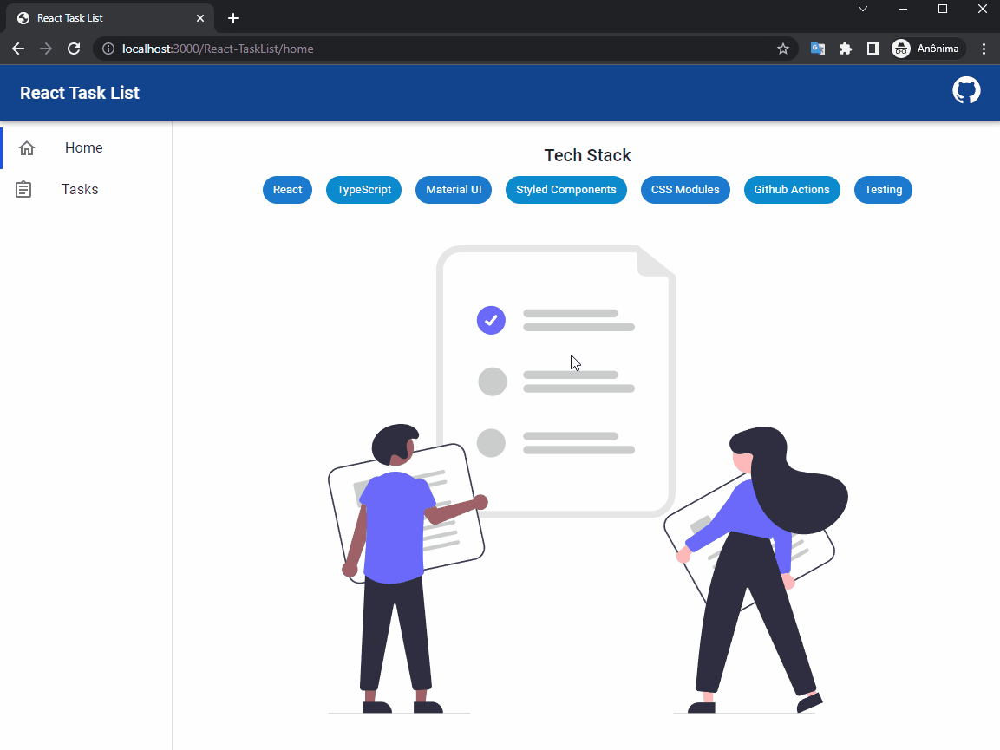
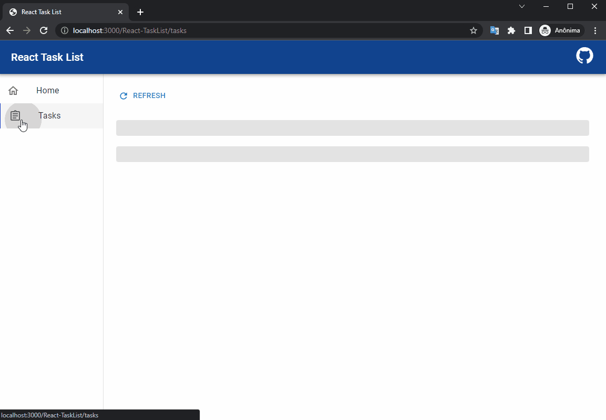
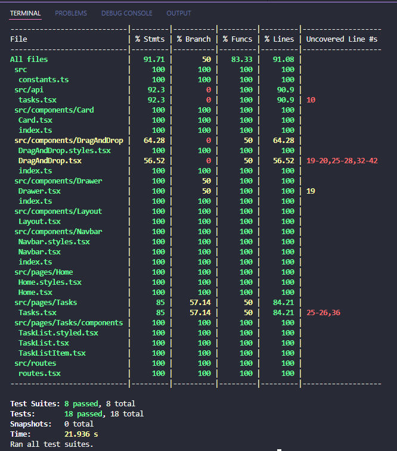
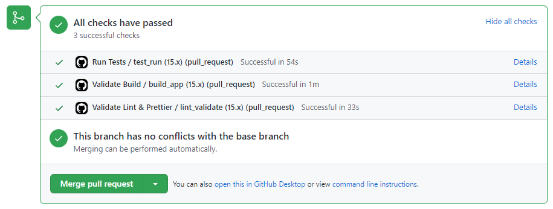

# React Task List

A simple Task List application built in React, using different technologies and following best practices.

## :earth_africa: Try it now

#### Access: https://lrmendes.github.io/React-TaskList

## :computer: Technologies

- :dart: React / TypeScript
- :pencil: Material UI, Styled Components, CSS Modules
- :lock: Testing (Jest, React-Testing-Library)
- :pushpin: Vite (Fast development)
- :bell: CI/CD (Github Actions):
  - :cloud: Perform Test, Lint and Build validations in each PR
  - :cloud: Deploy to GitHub pages after merging to master

## :tada: Application overview

##### :fire: Tasks Page: Fetching from API

##### :fire: Tasks Page: Error handling

##### :fire: Tests

##### :fire: CI/CD

## :running: Running Application

1. Clone this repository.
2. In the repository folder run: `yarn install` or `npm install`
3. After successfull installing the packages, run: `yarn dev` or `npm run dev`

#### Other scripts:

- `npm start` (runs in a development mode, with hot reload)
- `npm run dev` (runs in a development mode, with hot reload)
- `npm run test` (perform application tests using jest)
- `npm run lint` (execute linter and prettier and fix errors)
- `npm run lint:fix` (execute linter and fix errors)
- `npm run lint:format` (execute linter and fix errors)
- `npm run validate` ([CI] valite linter & prettier)
- `npm build` (build application)
